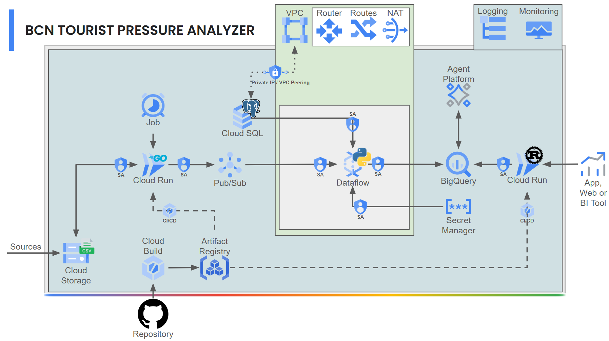

# Barcelona Tourist Pressure Analyzer

**In short: a polyglot, cloud-native, and zero-trust architecture for urban economic impact analysis.**

## Overview

*Understanding how short-term rentals reshape the economic landscape of modern cities is one of the biggest urban challenges today.*
*This project aims to bring data-driven clarity to this issue by focusing on Barcelona's real estate and tourism dynamics.*

This project implements a polyglot data pipeline designed to monitor and analyze tourist pressure in Barcelona (Spain). It correlates real-time simulated streams of Airbnb activity with official socio-economic datasets from the Barcelona Open Data portal.

By intersecting tourism volume with local household income, the goal is to understand the relationship between short-term rentals and neighborhood wealth, helping to identify areas at risk of gentrification, price inflation, and economic displacement of residents.

## Features

*This architecture is built to handle high-throughput streams, complex transformations, and secure infrastructure, bridging the gap between raw data and actionable intelligence.*

* **High-Concurrency Ingestion:** a lightweight, highly concurrent simulator built in Go (Golang) that streams thousands of events per second with minimal memory footprint.
* **Serverless Stream Processing:** a Python pipeline utilizing Apache Beam to perform stateful windowed aggregations and in-memory data enrichment.
* **Ultra-Fast Serving Layer:** a RESTful API built in Rust deployed on a serverless environment, completely eliminating Cold Starts and delivering millisecond response times.
* **Enterprise-Grade Security (Zero Trust):** a fully hardened network featuring a custom VPC, Private Cloud SQL, Cloud NAT/Router egress, Secret Manager for credentials, and least-privilege IAM Service Accounts.
* **In-Warehouse ML and GenAI:** leveraging BigQuery ML for native SQL-based Machine Learning (Random Forest, K-Means) and Vertex AI (Agent Platform) to generate natural language insights on gentrification risks.

## Stack

*To ensure scalability, extreme performance, and hardened security, this project leverages a modern GCP Serverless tech stack.*

* **Languages:** Go (Ingestion), Python (Processing), Rust (API)
* **Ingestion and Messaging:** Google Cloud Storage, Cloud Run Jobs, Cloud Pub/Sub
* **Big Data Engine:** Apache Beam on Google Cloud Dataflow
* **Databases:** Cloud SQL (PostgreSQL) and Google BigQuery
* **DevSecOps and CI/CD:** GitHub Actions, Cloud Build, Artifact Registry, Secret Manager
* **Networking:** Custom VPC, Private Services Access, Cloud Router, Cloud NAT
* **Reporting:** Looker Studio (or similar BI Tool like Tableau), an App or a Web

## Architecture

*The system follows an event-driven, strictly isolated architecture, orchestrated within a monorepo pattern via a unified Makefile.*

### 1. Ingestion and Messaging Layer
Reads historical `reviews.csv` and `calendar.csv` data from a Cloud Storage Data Lake. A Go-based Cloud Run Job acts as the producer, serializing the data to JSON and streaming it into Pub/Sub topics.

### 2. Processing and Enrichment Layer (VPC Isolated)
Cloud Dataflow (Python) acts as the consumer. To ensure security, Dataflow workers are deployed inside a private subnet. They retrieve database credentials from Secret Manager, connect to Cloud SQL via Private IP to fetch static socioeconomic context, and enrich the streaming data before loading it into BigQuery. Egress internet traffic for dependency resolution is safely routed through Cloud NAT.

### 3. Analytics and ML Layer
BigQuery serves as the central Data Warehouse. It executes scheduled SQL queries to train ML models (BigQuery ML) and interacts with the Vertex AI Agent Platform to generate automated text conclusions regarding neighborhood economic displacement.

### 4. API and Serving Layer
A Rust container deployed on Cloud Run provides external BI tools with secure, read-only REST access to the analytical datasets, shielded by strict IAM (`sa-api-rust`).

## Data Sources

*Transparency and open data are at the core of this analysis. All datasets used to feed this pipeline are publicly available, properly licensed, and meticulously cited.*

The datasets used in this project are publicly available and are used under the **Creative Commons Attribution 4.0 International License (CC BY 4.0)**.

* **Inside Airbnb:** Listing, calendar, and review datasets were sourced from [Inside Airbnb](http://insideairbnb.com/get-the-data/).
* **Open Data Barcelona:** Socio-economic datasets ("Renta disponible de los hogares per cápita") were sourced from the [Open Data Portal of the Ajuntament de Barcelona](https://opendata-ajuntament.barcelona.cat/).

*You can read the full text of the license here: [CC BY 4.0 License](https://creativecommons.org/licenses/by/4.0/)*

## License

*Open source is about sharing knowledge and empowering developers. This repository is provided under a permissive license to encourage learning, adaptation, and collaboration.*

This project is licensed under the **MIT License** - see the [LICENSE](LICENSE) file for details.